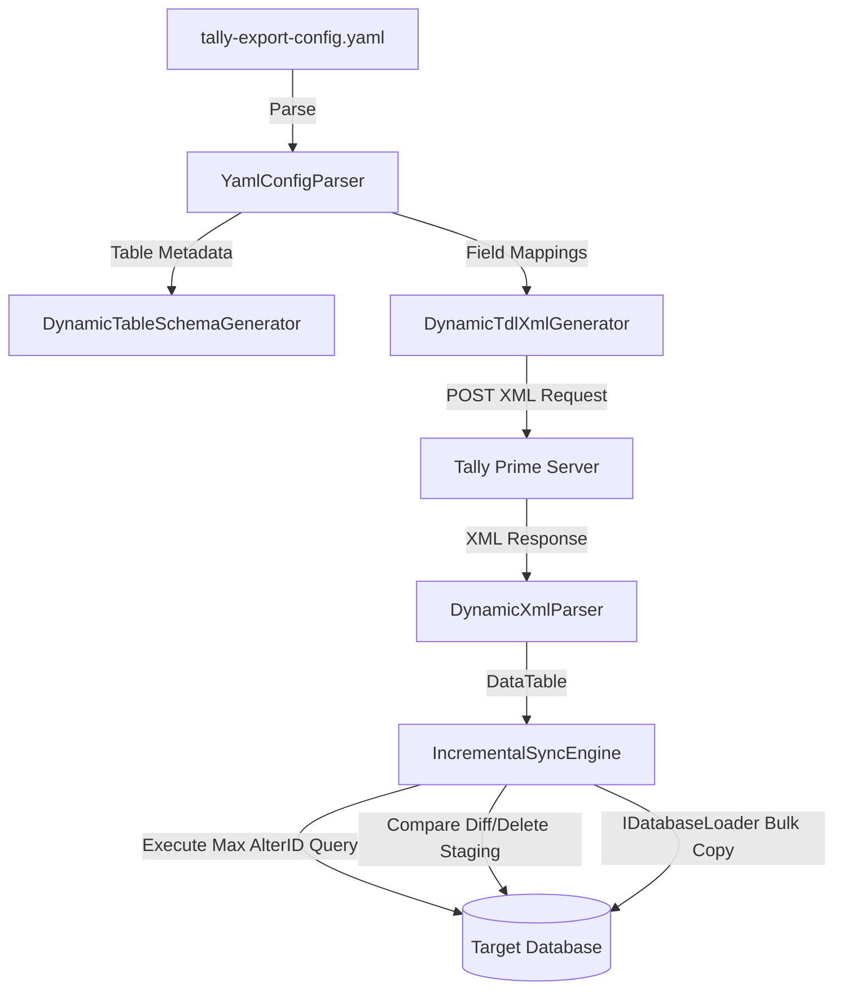

# Design Specification: Dynamic YAML-Driven .NET Loader Alignment

## 1. Context & Objective
The original Node.js database loader for Tally Prime is a dynamic, configuration-driven utility. It exports 30+ tables (Ledgers, Vouchers, Stock Items, Groups, etc.) by reading schema definitions from `tally-export-config.yaml` at runtime, generating custom Tally Definition Language (TDL) XML queries, and copying data into PostgreSQL, MySQL, and SQL Server (MSSQL) databases. It uses an incremental sync strategy based on Tally's `AlterId` to handle additions, alterations, and deletes.

The current C#/.NET port is hardcoded to a static set of fields for just the `Ledger` table, performs slow row-by-row upserts, and has no support for incremental sync, cascade operations, or MySQL.

This design document outlines the architecture to make the .NET port **fully feature-aligned** with the Node.js application.

---

## 2. Architectural Overview



We will replace the static, hardcoded sync worker with a dynamic sync engine in `TallyDbLoader.Core`. The library will depend on `YamlDotNet` for reading configuration and will build runtime metadata for all tables and collections.

---

## 3. Detailed Component Design

### 3.1 YAML Parser & Type Mapper (`YamlConfigParser.cs`)
Loads and deserializes `tally-export-config.yaml` into strongly-typed configurations matching `definition.ts` structs.

```csharp
public class TableConfig
{
    public string Name { get; set; } = string.Empty;
    public string Collection { get; set; } = string.Empty;
    public string Nature { get; set; } = string.Empty; // "Master" or "Transaction"
    public List<FieldConfig> Fields { get; set; } = new();
    public List<string>? Filters { get; set; }
    public List<string>? Fetch { get; set; }
    public List<CascadeRelation>? CascadeUpdate { get; set; }
    public List<CascadeRelation>? CascadeDelete { get; set; }
}

public class FieldConfig
{
    public string Name { get; set; } = string.Empty;
    public string Field { get; set; } = string.Empty;
    public string Type { get; set; } = string.Empty; // "text", "logical", "amount", "date", "number", "quantity", "rate"
}

public class CascadeRelation
{
    public string Table { get; set; } = string.Empty;
    public string Field { get; set; } = string.Empty;
}
```

#### Mapping Rules to Target Database Column Types:
| YAML Type | PostgreSQL | SQL Server (MSSQL) | MySQL | .NET System Type |
| :--- | :--- | :--- | :--- | :--- |
| **`text`** | `TEXT` | `VARCHAR(2000)` | `TEXT` | `string` |
| **`logical`** | `SMALLINT` | `TINYINT` | `TINYINT` | `short` / `byte` |
| **`amount`** | `NUMERIC(17,2)` | `DECIMAL(17,2)` | `DECIMAL(17,2)` | `decimal` |
| **`quantity`** | `NUMERIC(15,4)` | `DECIMAL(15,4)` | `DECIMAL(15,4)` | `decimal` |
| **`rate`** | `NUMERIC(15,4)` | `DECIMAL(15,4)` | `DECIMAL(15,4)` | `decimal` |
| **`number`** | `NUMERIC(17,2)` | `DECIMAL(17,2)` | `DECIMAL(17,2)` | `decimal` |
| **`date`** | `DATE` | `DATE` | `DATE` | `DateTime?` |

---

### 3.2 Dynamic TDL XML Query Generator (`DynamicTdlXmlGenerator.cs`)
Generates Tally request envelopes containing custom TDL message definitions. 

#### Handling Nested Collections (Explode):
If `tblConfig.Collection` contains dots (e.g. `Voucher.AllLedgerEntries.AllBillAllocations`), it splits the collection and constructs exploded nesting:
* Each level is generated as a `PART` and `LINE` containing `<EXPLODE>` tags.
* The terminal line contains `<FIELDS>` comma-separated field indices (`Fld01, Fld02, ...`).

#### Type-Specific Formula Building:
* **`logical`**: `<SET>if $FieldName then 1 else 0</SET>`
* **`date`**: `<SET>if $$IsEmpty:$FieldName then $$StrByCharCode:241 else $$PyrlYYYYMMDDFormat:$FieldName:"-"</SET>`
* **`amount`**: `<SET>$$StringFindAndReplace:(if $$IsDebit:$FieldName then -$$NumValue:$FieldName else $$NumValue:$FieldName):"(-)":"-"</SET>`
* **`quantity`**: `<SET>$$StringFindAndReplace:(if $$IsInwards:$FieldName then $$Number:$$String:$FieldName:"TailUnits" else -$$Number:$$String:$FieldName:"TailUnits"):"(-)":"-"</SET>`
* **`rate`**: `<SET>if $$IsEmpty:$FieldName then 0 else $$Number:$FieldName</SET>`
* **`number`**: `<SET>if $$IsEmpty:$FieldName then "0" else $$String:$FieldName</SET>`
* **Default**: `<SET>$FieldName</SET>`

---

### 3.3 Dynamic TDL Response Parser (`DynamicXmlParser.cs`)
Processes raw Tally XML responses using high-performance regex transformations to strip envelope tags and convert `<FXX>` elements into standard TSV (Tab Separated Values) streams:
1. Strips `<ENVELOPE>` wrappers and empty `<FLDBLANK></FLDBLANK>` tags.
2. Removes all inner closing tags (`</F\d+>`).
3. Replaces `<F01>` with `\r\n` (denoting new line boundaries).
4. Replaces other opening tags like `<F02>` through `<FNN>` with `\t` (column delimiters).
5. Performs standard HTML Entity decoding (`&amp;` -> `&`, etc.).
6. Feeds the resulting TSV text stream to a TSV-to-DataTable parser that handles type casting (converting empty/char-241 values to `DBNull.Value`).

---

### 3.4 Incremental Sync Coordinator (`IncrementalSyncEngine.cs`)
Tracks the current synchronization run state:
1. **Change Verification**: Queries Tally for the active company's `AltMstId` and `AltVchId`. Compares these to the database's `config` table entries (`Last AlterID Master` and `Last AlterID Transaction`). If they are identical, exits immediately with a "No change found" log.
2. **Setup Helper Tables**: Instantiates staging helper tables (`_diff`, `_delete`, and `_vchnumber`) dynamically.
3. **Modified & Deleted Row Detection (Staging Compare)**:
   * For each primary table (e.g. `mst_group`, `mst_ledger`, `trn_voucher`), queries Tally for its complete current list of `Guid` and `AlterId`.
   * Bulk-loads this mapping table into the target database's `_diff` table.
   * Finds records present in the database but missing from `_diff` (deleted records) and pushes their Guids to `_delete`.
   * Finds records where `_diff.alterid <> targetTable.alterid` (modified records) and pushes their Guids to `_delete`.
   * Executes deletion statements:
     ```sql
     DELETE FROM {tableName} WHERE guid IN (SELECT guid FROM _delete);
     ```
   * Cascades deletions to dependent child tables:
     ```sql
     DELETE FROM {childTable} WHERE {childField} IN (SELECT guid FROM _delete);
     ```
4. **Ingesting Updates**:
   * Appends an AlterId filter dynamically (`$AlterID > {LastDbAlterId}`) to Tally queries.
   * Loads fresh records into the main target tables via bulk loading.
5. **Post-Sync Synchronization Tasks**:
   * **Cascade Updates**: Executes join statements matching database type syntaxes to update denormalized field values.
   * **Voucher Number Alignment**: Fetches active voucher numbers from Tally for auto-numbered voucher types, dumps them to `_vchnumber`, and updates the target database.
   * Truncates staging helper tables.

---

### 3.5 High-Performance Bulk Loaders (`IDatabaseLoader.cs`)
Replaces slow row-by-row writing. Implements native bulk operations:
* **PostgreSQL**: Implements `BeginTextImport` streaming:
  ```csharp
  using (var writer = conn.BeginTextImport($"COPY {tableName} ({columns}) FROM STDIN WITH (FORMAT CSV, DELIMITER '\t', NULL '', HEADER FALSE)"))
  ```
* **SQL Server**: Implements native `SqlBulkCopy` passing in a mapped `DataTable`.
* **MySQL**: Implements `MySqlBulkCopy` using the `MySqlConnector` package (with `AllowLoadLocalInfile=true` added to the MySQL connection string builder).

---

## 4. Migration & File Impact

### New Files to Create:
* `src/TallyDbLoader.Core/Tally/DynamicTdlXmlGenerator.cs` (Handles TDL generation)
* `src/TallyDbLoader.Core/Tally/DynamicXmlParser.cs` (Regex-based TSV extraction and DataTable mapping)
* `src/TallyDbLoader.Core/Data/DynamicTableSchemaGenerator.cs` (Dynamically initializes SQL Server/PG/MySQL tables based on column configurations)

### Files to Modify:
* `src/TallyDbLoader.Core/TallyDbLoader.Core.csproj`: Add PackageReference for `YamlDotNet`.
* `src/TallyDbLoader.Core/Data/DatabaseWriter.cs`: Refactor to use dynamic schema definitions, database connection routing for MySQL, and integration with `IDatabaseLoader`.
* `src/TallyDbLoader.Core/Sync/BackgroundSyncWorker.cs`: Overhaul to implement the multi-phase incremental sync coordinator, instead of the static Ledger-only loop.

---

## 5. Testing & Verification Plan
* **Unit Tests**:
  * Verify that parsing a mock `tally-export-config.yaml` produces expected table structures.
  * Verify that `DynamicTdlXmlGenerator` builds valid explode structures and formula syntax for all data types.
  * Verify that `DynamicXmlParser` transforms a mock Tally XML envelope response into clean TSV.
* **Integration Tests**:
  * Execute staging deletes and incremental sync queries against local test databases (PostgreSQL, MSSQL, MySQL) using a mock Tally server response.
