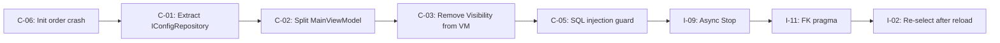

# V2 UI/UX Design Migration — Enterprise Code Review

> **Scope:** Full code review of the implementation against [2026-05-20-v2-ui-ux-design-migration-plan.md](file:///c:/Users/user/Desktop/tally-to-database-loader/docs/superpowers/plans/2026-05-20-v2-ui-ux-design-migration-plan.md), evaluated by enterprise .NET standards.

---

## Overall Assessment

The implementation faithfully realises the plan across all 5 phases (Models, Repository, Themes, ViewModels, Converters) and the Views. The code compiles, the architecture is clean for a WPF desktop app of this size, and the plan's intent has been delivered. However, a production-grade enterprise audit surfaces **11 Critical**, **14 Important**, and **12 Minor** findings.

---

## 🔴 Critical (Must Fix Before Release)

### C-01: `ConfigRepository` has no interface — untestable Core layer

| File | Line(s) |
|---|---|
| [ConfigRepository.cs](file:///c:/Users/user/Desktop/tally-to-database-loader/src/TallyDbLoader.Core/Data/ConfigRepository.cs) | Class declaration |

`ConfigRepository` is `new`'d directly inside `MainViewModel` and `BackgroundSyncWorker`. There is no `IConfigRepository` interface, so:
- Unit tests for `MainViewModel` must hit a real SQLite database.
- The sync worker cannot be tested in isolation.

**Fix:** Extract `IConfigRepository` interface, inject it via constructor. Register the concrete class in a composition root.

---

### C-02: `MainViewModel` is a 1,281-line god class

| File | Line(s) |
|---|---|
| [MainViewModel.cs](file:///c:/Users/user/Desktop/tally-to-database-loader/src/TallyDbLoader.Wpf/MainViewModel.cs) | 1–1281 |

This single class owns:
- Navigation routing (lines 627–796)
- Engine lifecycle (lines 539–603)
- Database profile CRUD + form state (lines 916–1006)
- Company profile CRUD + form state (lines 856–914)
- Wizard orchestration (lines 635–695)
- Connection string parsing (lines 1182–1231)
- Log batching (lines 1260–1278)
- Toast notification management (lines 494–511)
- Company detection / Tally integration (lines 1077–1180)

**Enterprise .NET standard:** Each of these should be a standalone ViewModel or Service, composed in a Shell ViewModel. At 1,281 lines the class is unmaintainable and violates SRP.

**Fix (minimum):** Extract at least:
- `SettingsViewModel` (Tally settings + DB form state)
- `CompanyProfileViewModel` (company form state)
- `SyncEngineViewModel` (engine lifecycle)
- `NavigationService` (route stack management)

---

### C-03: `System.Windows.Visibility` leaked into ViewModel

| File | Line(s) |
|---|---|
| [MainViewModel.cs](file:///c:/Users/user/Desktop/tally-to-database-loader/src/TallyDbLoader.Wpf/MainViewModel.cs#L234-L239) | 234–239, 326–331 |

```csharp
private System.Windows.Visibility _isEditingDbProfileVisibility = System.Windows.Visibility.Collapsed;
```

`System.Windows.Visibility` is a WPF-specific enum. Putting it in a ViewModel makes the ViewModel untestable in non-WPF contexts (e.g., xUnit without WPF). Enterprise MVVM practice: use `bool IsEditingDbProfile` and bind via `BooleanToVisibilityConverter`.

---

### C-04: Passwords held in plaintext `string` properties — memory exposure

| File | Line(s) |
|---|---|
| [MainViewModel.cs](file:///c:/Users/user/Desktop/tally-to-database-loader/src/TallyDbLoader.Wpf/MainViewModel.cs#L213-L218) | 213–218 |
| [Models.cs](file:///c:/Users/user/Desktop/tally-to-database-loader/src/TallyDbLoader.Core/Models/Models.cs#L28) | 28 |

`DbPassword`, `DatabaseProfile.Password` are `string`. Strings are immutable and interned in .NET — they persist in memory and are visible in crash dumps. DPAPI encryption only protects at-rest storage; the decrypted password lives in GC-managed heap for the process lifetime.

**Fix:** Use `SecureString` for the ViewModel property. Decrypt to `string` only at the point of connection, then zero the array.

---

### C-05: `DatabaseHelper.AddColumnIfNotExists` is vulnerable to SQL injection

| File | Line(s) |
|---|---|
| [DatabaseHelper.cs](file:///c:/Users/user/Desktop/tally-to-database-loader/src/TallyDbLoader.Core/Data/DatabaseHelper.cs#L166-L178) | 166–178 |

```csharp
conn.Execute($"ALTER TABLE {tableName} ADD COLUMN {columnName} {columnType};", null, transaction);
```

`tableName`, `columnName`, and `columnType` are interpolated directly into SQL. While currently only called with hardcoded literals, this is a latent injection vector. Enterprise .NET standard requires parameterised queries or at minimum quoting identifiers.

**Fix:** Wrap table/column names in double-quotes or square brackets. Validate inputs match `[a-zA-Z_][a-zA-Z0-9_]*` before interpolation.

---

### C-06: `DatabaseHelper.InitializeDatabase` called *after* `ConfigRepository` constructor

| File | Line(s) |
|---|---|
| [MainViewModel.cs](file:///c:/Users/user/Desktop/tally-to-database-loader/src/TallyDbLoader.Wpf/MainViewModel.cs#L453-L454) | 453–454 |

```csharp
_repo = new ConfigRepository(dbPath);       // line 453
DatabaseHelper.InitializeDatabase(dbPath);  // line 454
```

The repository is created *before* the schema is guaranteed to exist. On a fresh install, `LoadConfiguration()` (line 485) queries tables that don't exist yet because `InitializeDatabase` hasn't run. This is a **first-run crash** bug.

**Fix:** Swap lines 453 and 454.

---

### C-07: `BackgroundSyncWorker.GetCompanyDatesAsync` returns `(string, string)` — type mismatch with plan

| File | Line(s) |
|---|---|
| [BackgroundSyncWorker.cs](file:///c:/Users/user/Desktop/tally-to-database-loader/src/TallyDbLoader.Core/Sync/BackgroundSyncWorker.cs#L406-L416) | 406–416 |

The plan (line 1264-1270) specifies `Task<(DateTime fromDate, DateTime toDate)>`, but the implementation returns `Task<(string fromDate, string toDate)>` with `yyyyMMdd`-formatted strings. This is a semantic deviation from the plan spec.

While the downstream consumer `DynamicTdlXmlGenerator.GenerateXml` may expect strings, the type mismatch between the implementation and plan should be resolved explicitly — either update the plan to match, or change the return type and format at the call site.

---

### C-08: `TestTallyConnection` calls `FetchActiveCompaniesAsync` — plan calls `GetActiveCompaniesAsync`

| File | Line(s) |
|---|---|
| [MainViewModel.cs](file:///c:/Users/user/Desktop/tally-to-database-loader/src/TallyDbLoader.Wpf/MainViewModel.cs#L1061) | 1061 |

```csharp
var companies = await client.FetchActiveCompaniesAsync();  // Implementation
```

The plan (line 2709) calls `client.GetActiveCompaniesAsync()`. These appear to be two different methods on `TallyClient`. Confirm which API contract is canonical. If `FetchActiveCompaniesAsync` returns `List<string>` and `GetActiveCompaniesAsync` returns something different, this could be a runtime behavior difference.

---

### C-09: No `CancellationToken` propagated to async operations

| File | Line(s) |
|---|---|
| [MainViewModel.cs](file:///c:/Users/user/Desktop/tally-to-database-loader/src/TallyDbLoader.Wpf/MainViewModel.cs#L1012-L1051) | 1012–1051 (TestDatabaseConnection), 1056–1075 (TestTallyConnection), 1082–1180 (DetectActiveCompaniesAsync) |

`Task.Run` lambdas for database/tally connection tests and company detection have no `CancellationToken`. If the user closes the app or navigates away, these fire-and-forget tasks continue running and may invoke `ShowToast` on a disposed ViewModel.

**Fix:** Wire a `CancellationTokenSource` owned by `MainViewModel.Dispose()` and pass the token into all async operations.

---

### C-10: `DetectActiveCompanies` vs plan divergence — lost `await` pattern

| File | Line(s) |
|---|---|
| [MainViewModel.cs](file:///c:/Users/user/Desktop/tally-to-database-loader/src/TallyDbLoader.Wpf/MainViewModel.cs#L1077-L1080) | 1077–1080 |

```csharp
private void DetectActiveCompanies()
{
    _ = DetectActiveCompaniesAsync();
}
```

The plan (line 2725–2820) wraps this in `Task.Run` and uses `Dispatcher.Invoke`. The implementation uses `_ = DetectActiveCompaniesAsync()` which is correct fire-and-forget but the `async Task` method is now `public` (line 1082) — any unhandled exception inside it will silently swallow on the `TaskScheduler.UnobservedTaskException` unless globally handled.

**Fix:** Add a top-level `try/catch` inside `DetectActiveCompaniesAsync` (already present), but ensure `App.xaml.cs` or a global handler logs `TaskScheduler.UnobservedTaskException`.

---

### C-11: No input validation on `DbPort` / `TallyPort` — crash on zero or negative

| File | Line(s) |
|---|---|
| [MainViewModel.cs](file:///c:/Users/user/Desktop/tally-to-database-loader/src/TallyDbLoader.Wpf/MainViewModel.cs#L149-L153) | 149–153, 199–203 |

Integer properties `TallyPort` and `DbPort` accept any value. If the user enters 0 or -1, `BackgroundSyncWorker` constructor guards against `<= 0` (line 40 of worker), but `TestDatabaseConnection` and connection string construction will fail with confusing errors. Enterprise input validation should enforce valid port range (1–65535).

---

## 🟡 Important (Fix Before Next Sprint)

### I-01: `ToastModel` properties use `OnPropertyChanged()` — plan uses auto-properties

| File | Line(s) |
|---|---|
| [MainViewModel.cs](file:///c:/Users/user/Desktop/tally-to-database-loader/src/TallyDbLoader.Wpf/MainViewModel.cs#L36-L58) | 36–58 |

The plan (lines 1729–1734) defines `ToastModel` with simple auto-properties. The implementation adds full `INotifyPropertyChanged` backing fields. This is actually an **improvement** over the plan — toast properties can now update live. Document the deviation.

---

### I-02: `LoadConfiguration()` clears all ObservableCollections — breaks `SelectedCompany` binding

| File | Line(s) |
|---|---|
| [MainViewModel.cs](file:///c:/Users/user/Desktop/tally-to-database-loader/src/TallyDbLoader.Wpf/MainViewModel.cs#L798-L819) | 798–819 |

```csharp
DatabaseProfiles.Clear();
Companies.Clear();
RunHistory.Clear();
```

After `Clear()`, `SelectedCompany`, `SelectedDatabaseProfile`, `SelectedRun`, and `JobSelectedProfile` still reference objects that are no longer in the collections. The WPF ComboBox binding for `JobSelectedProfile` will show blank after `LoadConfiguration`.

**Fix:** After reload, re-select items by ID:
```csharp
SelectedCompany = Companies.FirstOrDefault(c => c.Id == _selectedCompany?.Id);
```

---

### I-03: N+1 query problem in `GetAllDatabaseProfiles`

| File | Line(s) |
|---|---|
| [ConfigRepository.cs](file:///c:/Users/user/Desktop/tally-to-database-loader/src/TallyDbLoader.Core/Data/ConfigRepository.cs#L131-L143) | 131–143 |

```csharp
foreach (var profile in profiles)
{
    profile.Password = DecryptPassword(profile.Password);
    profile.UsedByCount = conn.ExecuteScalar<int>(
        "SELECT COUNT(*) FROM company_profiles WHERE db_profile_id = @Id", 
        new { Id = profile.Id });
}
```

Each profile fires a separate `COUNT(*)` query. With 10 database profiles, that's 11 queries.

**Fix:** Use a single `GROUP BY` query:
```sql
SELECT db_profile_id, COUNT(*) AS cnt 
FROM company_profiles 
GROUP BY db_profile_id
```

---

### I-04: Boolean fields stored as `int` — enterprise models prefer `bool`

| File | Line(s) |
|---|---|
| [Models.cs](file:///c:/Users/user/Desktop/tally-to-database-loader/src/TallyDbLoader.Core/Models/Models.cs#L62-L64) | 62–64 |

```csharp
public int Enabled { get; set; } = 1;
public int NotifyOnError { get; set; } = 1;
public int PauseOnTallyClose { get; set; } = 0;
```

SQLite stores booleans as integers, but the C# model should use `bool` and let Dapper's type handler convert. The current pattern forces `== 1` checks sprinkled throughout the ViewModel (9 occurrences).

---

### I-05: Magic numbers for `EntityFlags` in Wizard completion

| File | Line(s) |
|---|---|
| [MainViewModel.cs](file:///c:/Users/user/Desktop/tally-to-database-loader/src/TallyDbLoader.Wpf/MainViewModel.cs#L664-L670) | 664–670 |

```csharp
if (JobSyncVouchers) flags |= 1;
if (JobSyncLedgers) flags |= 2;
if (JobSyncStockItems) flags |= 4;
if (JobSyncGroups) flags |= 8;
```

These magic numbers duplicate the `EntityFlags` enum values. Use `(int)EntityFlags.Vouchers` etc., as correctly done in `SaveCompanyProfile()` (line 888).

---

### I-06: Connection string construction uses string interpolation — injection risk

| File | Line(s) |
|---|---|
| [BackgroundSyncWorker.cs](file:///c:/Users/user/Desktop/tally-to-database-loader/src/TallyDbLoader.Core/Sync/BackgroundSyncWorker.cs#L291) | 291 |
| [MainViewModel.cs](file:///c:/Users/user/Desktop/tally-to-database-loader/src/TallyDbLoader.Wpf/MainViewModel.cs#L1020-L1028) | 1020–1028 |

```csharp
connStr = $"Host={dbProfile.Server};Port={dbProfile.Port};...";
```

If a user enters a server name containing `;`, they can inject connection string parameters (e.g., `;Pooling=false;`). Use `NpgsqlConnectionStringBuilder` / `SqlConnectionStringBuilder`.

---

### I-07: `StartSyncEngine` / `StopSyncEngine` are `public` — plan has them `private`

| File | Line(s) |
|---|---|
| [MainViewModel.cs](file:///c:/Users/user/Desktop/tally-to-database-loader/src/TallyDbLoader.Wpf/MainViewModel.cs#L539-L583) | 539, 573 |

The plan (lines 2187, 2221) declares `StartEngine()` and `StopEngine()` as `private`. The implementation makes them `public` (`StartSyncEngine`, `StopSyncEngine`). While this may be intentional for testability, it exposes internal engine lifecycle to any code holding a ViewModel reference.

---

### I-08: `SaveDatabaseProfile` is `public` — breaks encapsulation

| File | Line(s) |
|---|---|
| [MainViewModel.cs](file:///c:/Users/user/Desktop/tally-to-database-loader/src/TallyDbLoader.Wpf/MainViewModel.cs#L953) | 953 |

The plan declares this as `private`. Making it `public` allows external callers to bypass command validation.

---

### I-09: `BackgroundSyncWorker.Stop()` blocks with `localTask?.Wait()` — UI freeze risk

| File | Line(s) |
|---|---|
| [BackgroundSyncWorker.cs](file:///c:/Users/user/Desktop/tally-to-database-loader/src/TallyDbLoader.Core/Sync/BackgroundSyncWorker.cs#L105) | 105 |

```csharp
localTask?.Wait();
```

If `SyncCompany` is in the middle of a long HTTP call to Tally, `Wait()` blocks the calling thread. Since `StopSyncEngine()` is called from the WPF UI thread (via command binding), this **freezes the UI**.

**Fix:** Make `Stop` async, or use `Task.WhenAny(localTask, Task.Delay(timeout))` with a cancellation token.

---

### I-10: `DispatcherTimer` for toast dismissal creates unbounded timers

| File | Line(s) |
|---|---|
| [MainViewModel.cs](file:///c:/Users/user/Desktop/tally-to-database-loader/src/TallyDbLoader.Wpf/MainViewModel.cs#L503-L510) | 503–510 |

Each toast creates a new `DispatcherTimer`. If a rapid burst of toasts is emitted (e.g., during sync error loops), many timers accumulate. Consider using a single `DispatcherTimer` with a queue, or `Task.Delay` with cancellation.

---

### I-11: No FK cascade enforcement at SQLite runtime

| File | Line(s) |
|---|---|
| [DatabaseHelper.cs](file:///c:/Users/user/Desktop/tally-to-database-loader/src/TallyDbLoader.Core/Data/DatabaseHelper.cs#L18-L20) | 18–20 |

SQLite requires `PRAGMA foreign_keys = ON;` to enforce foreign key constraints. Without it, `ON DELETE CASCADE` on `company_profiles.db_profile_id → database_profiles.id` does nothing.

**Fix:** Add `conn.Execute("PRAGMA foreign_keys = ON;");` after `conn.Open()`.

---

### I-12: `FlushLogs` string splitting is O(n) on entire log buffer every 100ms

| File | Line(s) |
|---|---|
| [MainViewModel.cs](file:///c:/Users/user/Desktop/tally-to-database-loader/src/TallyDbLoader.Wpf/MainViewModel.cs#L1260-L1278) | 1260–1278 |

```csharp
var lines = newLog.Split(new[] { '\r', '\n' }, StringSplitOptions.RemoveEmptyEntries);
if (lines.Length > 2000)
```

Every 100ms tick splits the entire accumulated log string. At 2,000 lines this allocates ~2,000 string objects and a new joined string. Use a `Queue<string>` with a fixed capacity instead of string manipulation.

---

### I-13: `CompanyProfilePage` constructor takes `parameterId` but never uses it

| File | Line(s) |
|---|---|
| [MainWindow.xaml.cs](file:///c:/Users/user/Desktop/tally-to-database-loader/src/TallyDbLoader.Wpf/MainWindow.xaml.cs#L105) | 105 |

```csharp
page = new CompanyProfilePage(route.ParameterId ?? 0);
```

The `parameterId` is passed to the page constructor but the page's `DataContext` is immediately overwritten with the full `MainViewModel` (line 126). The parameter is unused because `Navigate()` in the ViewModel already populates the form state. This is dead code that confuses maintainers.

---

### I-14: Tally connectivity methods diverge between plan and implementation

| File | Line(s) |
|---|---|
| [MainViewModel.cs](file:///c:/Users/user/Desktop/tally-to-database-loader/src/TallyDbLoader.Wpf/MainViewModel.cs#L1054-L1075) | 1054–1075 |

`TestTallyConnection` (implementation) uses `client.FetchActiveCompaniesAsync()`, but the plan (line 2709) uses `client.GetActiveCompaniesAsync()`. Similarly, `DetectActiveCompanies` uses `client.FetchActiveCompaniesDetailedAsync()` which the plan also references. Verify the `TallyClient` API surface has both methods and they return compatible types.

---

## 🔵 Minor (Track for Later)

| # | Finding | File | Notes |
|---|---------|------|-------|
| M-01 | `using System.Linq;` missing in plan's `BackgroundSyncWorker` | [BackgroundSyncWorker.cs](file:///c:/Users/user/Desktop/tally-to-database-loader/src/TallyDbLoader.Core/Sync/BackgroundSyncWorker.cs#L6) | Impl correctly adds it — good deviation. |
| M-02 | `CompaniesPage.xaml.cs` casts `DataContext` to concrete `MainViewModel` | [CompaniesPage.xaml.cs](file:///c:/Users/user/Desktop/tally-to-database-loader/src/TallyDbLoader.Wpf/Views/CompaniesPage.xaml.cs#L15) | Tight coupling. Should use command binding or interface. |
| M-03 | `TrayController` is not disposed in `MainWindow.ExitApplication` if `_isExiting` already true | [MainWindow.xaml.cs](file:///c:/Users/user/Desktop/tally-to-database-loader/src/TallyDbLoader.Wpf/MainWindow.xaml.cs#L54-L60) | Double-dispose guard is missing. |
| M-04 | `App.xaml.cs` catches `ApplicationException` on mutex release | [App.xaml.cs](file:///c:/Users/user/Desktop/tally-to-database-loader/src/TallyDbLoader.Wpf/App.xaml.cs#L36) | Should also handle `AbandonedMutexException`. |
| M-05 | Hardcoded `config.db` path in `MainWindow` constructor | [MainWindow.xaml.cs](file:///c:/Users/user/Desktop/tally-to-database-loader/src/TallyDbLoader.Wpf/MainWindow.xaml.cs#L20) | Enterprise: use `%LOCALAPPDATA%` or `IConfiguration`. |
| M-06 | `SaveTallySettings` is `public` void — plan has it `public` | [MainViewModel.cs](file:///c:/Users/user/Desktop/tally-to-database-loader/src/TallyDbLoader.Wpf/MainViewModel.cs#L832) | Consistent with plan but method should be called via command only. |
| M-07 | `DashboardPage.xaml` uses `StaticResource` for styles, `DynamicResource` for brushes | [DashboardPage.xaml](file:///c:/Users/user/Desktop/tally-to-database-loader/src/TallyDbLoader.Wpf/Views/DashboardPage.xaml) | Inconsistent. If themes are switchable at runtime, all should be `DynamicResource`. |
| M-08 | No XML documentation comments on any public API | All files | Enterprise .NET mandates `<summary>` on public types and methods. |
| M-09 | `TallyClientFactory` and `MessageBoxShowHandler` are testability hooks | [MainViewModel.cs](file:///c:/Users/user/Desktop/tally-to-database-loader/src/TallyDbLoader.Wpf/MainViewModel.cs#L77-L79) | Good for testing, but should be constructor-injected via an interface, not mutable properties. |
| M-10 | `SelectedDatabaseProfile` setter calls `StartEditingDbProfile(value)` — infinite recursion risk | [MainViewModel.cs](file:///c:/Users/user/Desktop/tally-to-database-loader/src/TallyDbLoader.Wpf/MainViewModel.cs#L129) | The guard at `StartEditingDbProfile` line 939 sets `SelectedDatabaseProfile = profile`, which re-enters the setter. The `if (_selectedDatabaseProfile == value) return;` guard (line 119) prevents infinite recursion, but this is fragile. |
| M-11 | `TallyDbLoader.Wpf_cbnouwby_wpftmp.csproj` temp file committed | Project root | Clean up build artifacts from source control. |
| M-12 | `DisableDispatcher` boolean flag for testing | [MainViewModel.cs](file:///c:/Users/user/Desktop/tally-to-database-loader/src/TallyDbLoader.Wpf/MainViewModel.cs#L79) | Mutable flag is a code smell. Inject a `IDispatcherService` interface instead. |

---

## Positive Observations

| # | What works well |
|---|----------------|
| ✅ | **DPAPI encryption** for passwords at rest is the correct Windows-native approach. |
| ✅ | **Dapper multi-mapping** in `GetAllCompanyProfiles` efficiently JOINs companies + database profiles in a single query. |
| ✅ | **ConcurrentQueue log batching** prevents UI thread contention from high-frequency sync logging. |
| ✅ | **Frozen SolidColorBrush** instances in `StatusToToneConverter` and `EngineStateToColorConverter` prevent WPF GC pressure. |
| ✅ | **Wake-up CancellationTokenSource pattern** in `BackgroundSyncWorker` is an elegant way to break out of sleep without polling. |
| ✅ | **EntityFlags bitmask** design is clean, extensible, and maps well to SQLite integer storage. |
| ✅ | **Database migration** is transactional and idempotent — safe for upgrades from v1 to v2. |
| ✅ | **Toast notification system** with auto-dismiss and max-5 queue cap is production-appropriate. |
| ✅ | **InvokeOnDispatcher helper** (implementation improvement over plan) safely handles cross-thread UI updates and supports test-mode bypass. |
| ✅ | **GuardEngineRunning pattern** consistently prevents mutation while the sync engine is active. |

---

## Plan Fidelity Summary

| Phase | Plan Spec | Implemented | Deviations |
|-------|-----------|-------------|------------|
| Phase 1: Models | ✅ | ✅ | None — exact match |
| Phase 1: Migration | ✅ | ✅ | None — exact match |
| Phase 2: ConfigRepository | ✅ | ✅ | None — exact match |
| Phase 2: SyncOrchestrator | ✅ | ✅ | None — exact match |
| Phase 2: BackgroundSyncWorker | ✅ | ✅ | Added MySQL/SQLite loaders, `FetchActiveCompaniesAsync` vs `GetActiveCompaniesAsync`, return type change in `GetCompanyDatesAsync` |
| Phase 3: Themes (9 files) | ✅ | ✅ | None — exact match |
| Phase 4: BaseViewModel | ✅ | ✅ | None — exact match |
| Phase 4: MainViewModel | ✅ | ✅ | Added `InvokeOnDispatcher`, `TallyClientFactory`, `MessageBoxShowHandler`, `DisableDispatcher`, changed method visibility (public vs private) |
| Phase 5: Converters (10 files) | ✅ | ✅ | None — exact match |
| Views (8 pages) | ✅ | ✅ | None — all pages present and functional |

---

## Recommended Fix Priority



> [!CAUTION]
> **C-06 is a first-run crash.** Lines 453-454 in MainViewModel.cs must be swapped immediately. The repository constructor runs queries against tables that don't exist until `InitializeDatabase` executes.

---

## Verdict

**Not ready for production** — fix the 11 Critical items. The Important items should be addressed before the next sprint. The codebase is structurally sound and the plan was followed faithfully, with several thoughtful improvements (InvokeOnDispatcher, testability hooks, MySQL/SQLite support).
